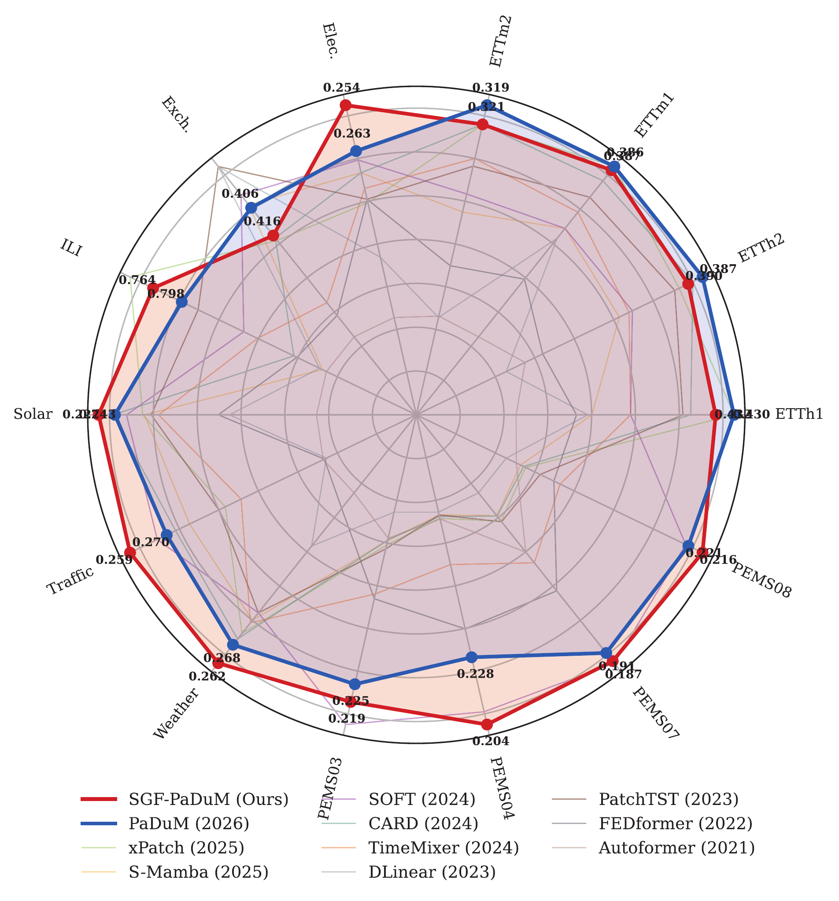
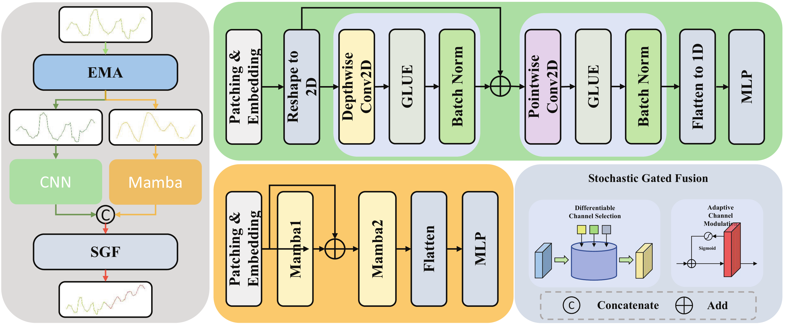
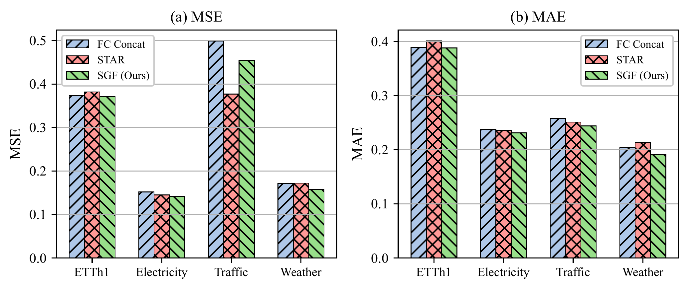
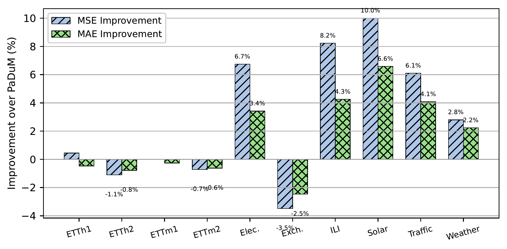
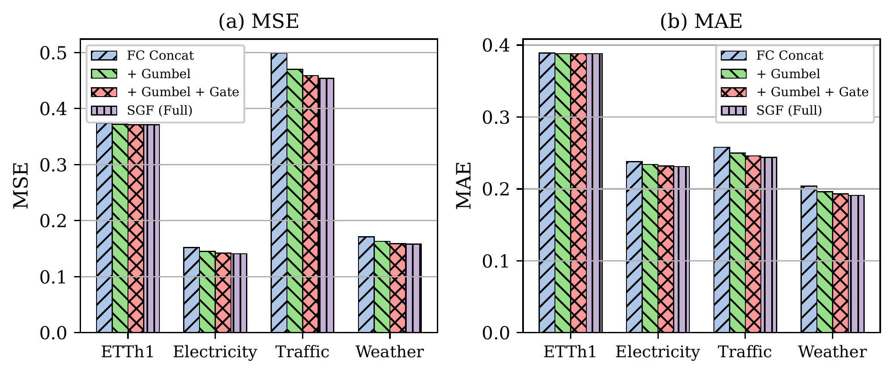
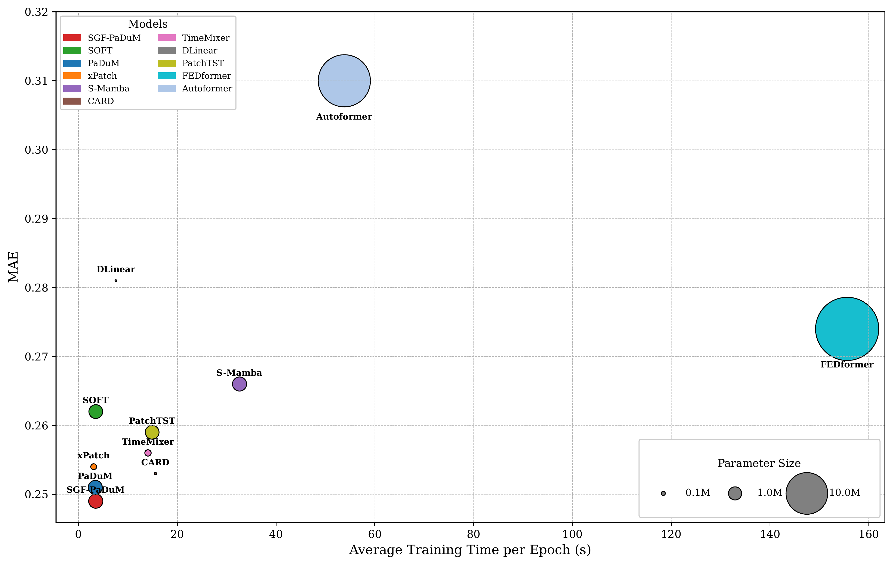

# SGF-PaDuM: Stochastic Gated Fusion and Robust Training for Time Series Forecasting

<div align="center">

[](LICENSE)
[]()

**Hongbing Wang, Junliang Tao, Li Cao, Chenhao Xie, Jian Li, Liang Zhou**

*School of Big Data and Computer Science, Guizhou Normal University, Guiyang, China*

</div>

> ⚠️ **Note**: This paper is currently under review. The code is released for peer review and research purposes.

## 📝 Abstract

This paper presents **SGF-PaDuM**, an enhanced version of PaDuM that introduces **Stochastic Gated Fusion (SGF)** for more effective feature integration. Building upon the patch-based dual-stream architecture combining CNN and Mamba, SGF-PaDuM employs Gumbel-Softmax based differentiable channel selection, sigmoid gating, and residual projection to adaptively fuse seasonal and trend features. This approach enables the model to learn optimal feature importance weights through channel encoding and adaptive gating mechanisms, resulting in improved forecasting accuracy especially on complex real-world datasets including traffic and energy domains. Additionally, we design a robust training strategy combining HuberLoss with Sigmoid temporal weighting for better MSE-MAE balance.

<div align="center">

<p><em>Average MAE comparison across fourteen benchmark datasets. SGF-PaDuM consistently achieves the lowest MAE across most datasets.</em></p>
</div>

## 🌟 Highlights

- **Stochastic Gumbel Fusion**: Novel fusion mechanism using Gumbel-Softmax for differentiable feature selection and integration.

- **Adaptive Channel Gating**: Learns optimal feature importance weights through channel encoding and sigmoid gating.

- **Enhanced Dual-Stream Architecture**: Builds upon PaDuM's CNN-Mamba framework with improved feature fusion.

- **Extended Dataset Support**: Validated on 14 real-world datasets including PEMS traffic datasets (PEMS03, PEMS04, PEMS07, PEMS08).

- **Flexible Core Dimension**: Configurable `d_core` parameter for controlling the fusion bottleneck dimension.

## 🏗️ Architecture

<div align="center">

<p><em>Overview of the SGF-PaDuM framework with Stochastic Gated Fusion module.</em></p>
</div>

### SGF-PaDuM Framework

SGF-PaDuM extends PaDuM with a novel **Stochastic Gated Fusion (SGF)** module:

```
Input Time Series
       ↓
   EMA Decomposition
       ↓
   ┌───────────┐
   │ Seasonal  │ → CNN Stream → Local Patterns
   └───────────┘
   ┌───────────┐
   │   Trend   │ → Mamba Stream → Long-term Dependencies
   └───────────┘
       ↓
   Concatenation
       ↓
   ┌───────────────────────────────────┐
   │    Stochastic Gated Fusion (SGF)  │
   │  ┌─────────────────────────────┐  │
   │  │ Channel Encoding (GELU)     │  │
   │  │          ↓                  │  │
   │  │ Core Dimension Reduction    │  │
   │  │          ↓                  │  │
   │  │ Gumbel-Softmax Selection    │  │
   │  │          ↓                  │  │
   │  │ Sigmoid Gating              │  │
   │  │          ↓                  │  │
   │  │ Residual Projection         │  │
   │  └─────────────────────────────┘  │
   └───────────────────────────────────┘
       ↓
   FC Projection → Prediction
```

### Key Components:

1. **EMA Decomposition**: Separates input into trend and seasonal components

2. **CNN Stream**: Extracts local patterns from seasonal component

3. **Mamba Stream**: Models long-term dependencies from trend component

4. **Stochastic Gated Fusion (SGF)**:
   - **Channel Encoding**: Learns feature representations with GELU activation
   - **Core Dimension Reduction**: Projects to lower-dimensional space (`d_core`)
   - **Gumbel-Softmax Selection**: Differentiable soft channel selection (all channels receive gradients)
   - **Sigmoid Gating**: Adaptive feature modulation based on global context
   - **Residual Projection**: Preserves original features while learning refinements

### SGF vs Other Fusion Strategies

<div align="center">

<p><em>Comparison of fusion modules (FC Concat, STAR, SGF) across four datasets. SGF achieves the best overall balance between MSE and MAE.</em></p>
</div>

## 📊 Supported Datasets

SGF-PaDuM supports 14 real-world datasets across multiple domains:

### Energy & Weather (7 datasets)
| Dataset | Features | Description |
|---------|----------|-------------|
| ETTh1 | 7 | Electricity Transformer Temperature (Hourly) |
| ETTh2 | 7 | Electricity Transformer Temperature (Hourly) |
| ETTm1 | 7 | Electricity Transformer Temperature (15min) |
| ETTm2 | 7 | Electricity Transformer Temperature (15min) |
| Weather | 21 | Weather station measurements |
| Electricity | 321 | Electricity consumption |
| Solar | 137 | Solar energy production |

### Traffic (7 datasets)
| Dataset | Features | Description |
|---------|----------|-------------|
| Traffic | 862 | Road traffic occupancy |
| Exchange Rate | 8 | Currency exchange rates |
| National Illness | 7 | CDC illness reports |
| PEMS03 | 358 | Traffic flow (PeMS District 3) |
| PEMS04 | 307 | Traffic flow (PeMS District 4) |
| PEMS07 | 883 | Traffic flow (PeMS District 7) |
| PEMS08 | 170 | Traffic flow (PeMS District 8) |

## 📊 Main Results

### Performance Improvement over PaDuM

<div align="center">

<p><em>Average MSE and MAE improvement of SGF-PaDuM over PaDuM across fourteen benchmark datasets. Positive values indicate SGF-PaDuM outperforms PaDuM.</em></p>
</div>

### Ablation Studies

#### SGF Module Components

<div align="center">

<p><em>Ablation on SGF module components across four datasets. Each bar group shows the incremental improvement from adding Gumbel Softmax, sigmoid gating, and residual connection.</em></p>
</div>

#### Robust Training with HuberLoss

The robust training strategy combines HuberLoss with Sigmoid temporal weighting:
- **HuberLoss**: Combines MSE (smooth gradients) and MAE (robust to outliers) advantages
- **Sigmoid Weighting**: Emphasizes recent predictions for better short-term accuracy
- **Optimal δ=0.05**: Best balance between MSE and MAE optimization

### Efficiency Analysis

<div align="center">

<p><em>Comparison of model training efficiency on ETTm2 dataset. SGF-PaDuM achieves the best MAE with fewer parameters and shorter training time.</em></p>
</div>

## 🛠️ Installation

### Prerequisites

- Python 3.9+
- PyTorch 2.1.0+
- CUDA 11.8+ (for Mamba support)

### Setup

```bash
# Clone the repository
git clone https://github.com/your-username/SGF-PaDuM.git
cd SGF-PaDuM

# Create conda environment (recommended)
conda create -n sgf-padum python=3.9
conda activate sgf-padum

# Install PyTorch (adjust CUDA version as needed)
pip install torch==2.1.0 torchvision==0.16.0 torchaudio==2.1.0 --index-url https://download.pytorch.org/whl/cu118

# Install Mamba
pip install mamba-ssm==1.2.0

# Install other dependencies
pip install -r requirements.txt
```

### Dependencies

- `torch==2.1.0`
- `mamba-ssm==1.2.0`
- `numpy==1.26.4`
- `scikit-learn==1.3.0`
- `matplotlib==3.7.0`
- `reformer-pytorch==1.4.4`

## 🚀 Quick Start

### Data Preparation

Datasets are included in the `./dataset/` folder. If you need to download them separately:

- **ETT datasets**: [GitHub](https://github.com/zhouhaoyi/ETDataset)
- **PEMS datasets**: [Google Drive](https://drive.google.com/drive/folders/1d6J8nMj3BArf-RWxGOzyXmVfSfLWhfpd)

### Training

```bash
# Train on ETTh1 dataset
python run.py \
    --is_training 1 \
    --dataset_id ETTh1 \
    --model SGF \
    --data ETTh1 \
    --root_path ./dataset/ \
    --data_path ETTh1.csv \
    --features M \
    --seq_len 96 \
    --label_len 48 \
    --pred_len 96 \
    --patch_len 16 \
    --stride 8 \
    --enc_in 7 \
    --d_model 256 \
    --d_state 2 \
    --d_core 128 \
    --batch_size 128 \
    --learning_rate 0.0005 \
    --train_epochs 100 \
    --ma_type ema \
    --alpha 0.3 \
    --beta 0.3

# Or use the provided script to train on all datasets
bash scripts/all.sh
```

### Evaluation

```bash
# Evaluate trained model
python run.py \
    --is_training 0 \
    --dataset_id ETTh1 \
    --model SGF \
    --data ETTh1 \
    --root_path ./dataset/ \
    --data_path ETTh1.csv \
    --features M \
    --seq_len 96 \
    --label_len 48 \
    --pred_len 96 \
    --patch_len 16 \
    --stride 8 \
    --enc_in 7 \
    --d_model 256 \
    --d_state 2 \
    --d_core 128 \
    --ma_type ema
```

### Key Arguments

| Argument | Description | Default |
|----------|-------------|---------|
| `--model` | Model name | `SGF` |
| `--data` | Dataset name | `ETTh1` |
| `--data_path` | Data file name | `ETTh1.csv` |
| `--seq_len` | Look-back window | `96` |
| `--label_len` | Label length | `48` |
| `--pred_len` | Prediction horizon | `96` |
| `--features` | Feature type (`M`/`S`/`MS`) | `M` |
| `--enc_in` | Number of input features | `7` |
| `--d_model` | Model dimension | `256` |
| `--d_state` | Mamba state dimension | `2` |
| `--d_core` | **Core fusion dimension** | `128` |
| `--patch_len` | Patch length | `16` |
| `--stride` | Patch stride | `8` |
| `--ma_type` | Moving average type (`ema`/`dema`/`reg`) | `ema` |
| `--alpha` | EMA smoothing factor | `0.3` |
| `--beta` | DEMA smoothing factor | `0.3` |
| `--learning_rate` | Learning rate | `0.0001` |
| `--batch_size` | Batch size | `32` |
| `--train_epochs` | Training epochs | `100` |
| `--Slope` | Sigmoid loss slope | `0.5` |
| `--Center` | Sigmoid loss center | `10.0` |
| `--lower_bound` | Sigmoid loss lower bound | `0.2` |
| `--revin` | Use Reversible Instance Norm (`1`=True, `0`=False) | `1` |

## 📁 Project Structure

```
SGF-PaDuM/
├── models/
│   ├── PaDuM.py           # Original PaDuM model
│   └── SGF_PaDuM.py       # SGF-PaDuM model with Gumbel Fusion
├── layers/
│   ├── net_CNN.py         # CNN stream implementation
│   ├── net_Mamba.py       # Mamba stream implementation
│   ├── network.py         # Original dual-stream network
│   ├── sgf_network.py     # SGF-enhanced fusion network
│   ├── sgf_fusion.py      # Stochastic Gumbel Fusion module
│   ├── ema.py             # Exponential Moving Average
│   ├── dema.py            # Double EMA
│   ├── decomp.py          # Decomposition layer
│   └── revin.py           # Reversible Instance Normalization
├── data_provider/
│   ├── data_factory.py    # Data loading factory
│   └── data_loader.py     # Dataset implementations
├── exp/
│   ├── exp_basic.py       # Base experiment class
│   └── exp_main.py        # Main experiment logic
├── utils/
│   ├── tools.py           # Utility functions
│   ├── metrics.py         # Evaluation metrics (MSE, MAE)
│   └── timefeatures.py    # Time feature engineering
├── scripts/
│   └── all.sh             # Training script for all datasets
├── dataset/               # Datasets (included)
├── run.py                 # Main entry point
├── requirements.txt       # Dependencies
├── LICENSE                # MIT License
└── README.md              # This file
```

## 📖 Citation

If you find this work useful, please cite our paper:

```bibtex
@article{wang2026sgfpadum,
  title={SGF-PaDuM: Stochastic Gated Fusion and Robust Training for Time Series Forecasting},
  author={Wang, Hongbing and Tao, Junliang and Cao, Li and Xie, Chenhao and Li, Jian and Zhou, Liang},
  year={2026},
  note={Under Review}
}
```

## 🙏 Acknowledgements

This work was supported by:
- National Natural Science Foundation of China (U22A2026, 62072097)
- QIANHEHE PLATFORM TALENT BQW[2024]015
- GZNU[2024]01

We thank the developers of:
- [PaDuM](https://github.com/T-DXVN/PaDuM) - Original dual-stream architecture
- [Time Series Library (TS-Lib)](https://github.com/thuml/Time-Series-Library) - Codebase foundation

## 📧 Contact

For questions or collaborations, please contact:

- **Corresponding Author**: Hongbing Wang (hbwang@gznu.edu.cn)
- **First Author**: Junliang Tao

## 📄 License

This project is licensed under the MIT License - see the [LICENSE](LICENSE) file for details.

---

<div align="center">

**⭐ Star this repository if you find it helpful!**

</div>
